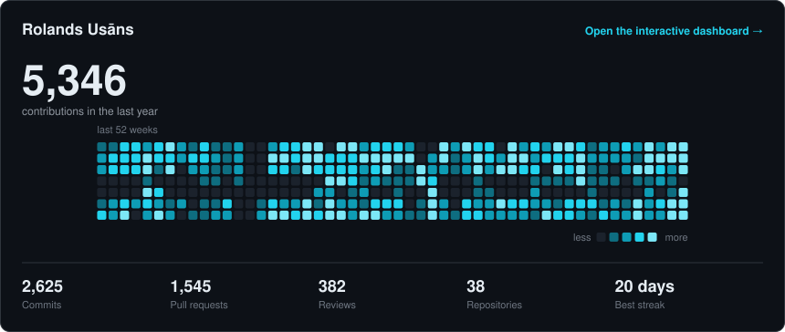

<h1 align="center">
  <a href="https://github.com/rolandsusans">
    
  </a>
</h1>

<p align="center">
  <a href="https://www.linkedin.com/in/rolandsusans"></a>
  <a href="https://twitter.com/Rolands_Usans"></a>
  <a href="https://www.youtube.com/c/RolandsUs%C4%81ns"></a>
  <a href="https://www.instagram.com/rolands_usans"></a>
  <a href="mailto:rolands.usans@gmail.com"></a>
</p>

<p align="center">
  
  
  
</p>

---

## 🧑‍💻 About me

```yaml
name:      Rolands Usāns
role:      Software Engineer @ Fyul
location:  Riga, Latvia 🇱🇻
focus:     building scalable backend services & developer tooling
passions:  GenAIOps, applied AI, agent harnesses, n8n, end-to-end automation
learning:  TypeScript deep-dives, Kubernetes internals, applied ML
hobbies:   longboarding, drones, running (21 km PB 🏃)
fun-fact:  I tinker with ESP32 + DHT11 air sensors and Netatmo exporters
```

---

## 🔭 Exploring & curious about

<p align="center">
  
  
  
  
  
</p>

---

## 🛠️ Tech stack

<p align="center">
  
</p>

---

## 📊 GitHub stats

<p align="center">
  <a href="https://rolandsusans.github.io/rolandsusans/">
    <picture>
      <source media="(prefers-color-scheme: dark)" srcset="./assets/card-dark.svg" />
      <source media="(prefers-color-scheme: light)" srcset="./assets/card-light.svg" />
      
    </picture>
  </a>
</p>

<p align="center">
  <a href="https://rolandsusans.github.io/rolandsusans/"><b>→ Open the interactive dashboard</b></a><br />
  <sub>Hover the calendar, switch the range, filter by language, sort the repositories.</sub>
</p>

<p align="center"><sub>Rebuilt daily from the GitHub GraphQL API. The card is committed to this repo, so no third-party host can break it.</sub></p>

<p align="center"><sub>⚡ Built with caffeine in Riga · last polished 2026</sub></p>
